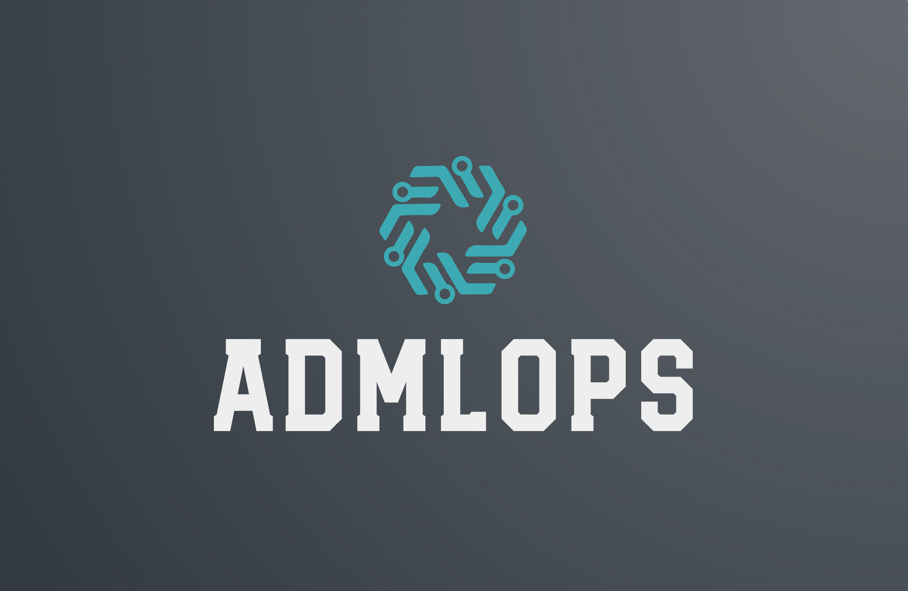
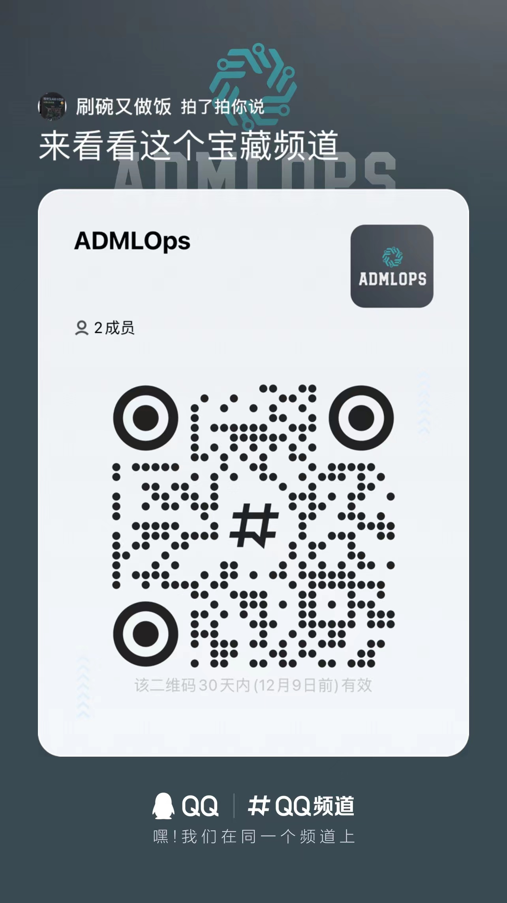

  
  
&nbsp;

[📘Documentation](https://admlops.readthedocs.io/en/stable/) |
[🛠️Installation](https://admlops.readthedocs.io/en/stable/get_started.html) |
[👀Model Zoo](https://admlops.readthedocs.io/en/stable/model_zoo.html) |
[🆕Update News](https://admlops.readthedocs.io/en/stable/changelog.html) |
[🚀Ongoing Projects](https://github.com/windzu/admlops/projects) |
[🤔Reporting Issues](https://github.com/windzu/admlops/issues/new/choose)

English | [简体中文](README_zh-CN.md)

## Introduction

ADMLOps is an MLOps open source tool for autonomous driving perception tasks. The goal is to solve the three problems of **data**, **model**, and **deployment** in autonomous driving perception tasks in a one-stop manner.

Major features

- **Embrace Open Source**

  Many components of ADMLOps are completely dependent on open source software, for example, the data partly relies on open source datasets, labeling tools, and management tools; the model partly relies on open source algorithms and open source frameworks, etc. A lot of work can be done by reusing the excellent open source software of the predecessors, there is no need to spend energy on reinventing the wheel

- **Modular Design**

  ADMLOps的模型部分主要基于 open-mmlab 的系列工具，借助其优秀的模块化设计，可以轻松的将检测框架解耦成不同的模块组件，通过组合不同的模块组件，用户可以便捷地构建自定义的检测模型

- **紧贴实践**

  ADMLOps 项目的起源是为了提高个人在自动驾驶感知工作中的效率，因此在设计时，ADMLOps 的很多模块都是紧贴实践的，例如传感器的选型、方案的选择、如何标定、数据采集、数据标注、模型的选择、模型的训练、模型的部署等等，都是基于实际工作中的经验总结

- **开箱即用**

  ADMLOps 中将提供大量的 tutorials 和 demo，通过简单的配置即可快速的测试某个数据集在某种模型上的效果，并提供相应的可视化展示

## What's New

### 💎 Stable version

最新的 **1.0.0** 版本

- 基于open-mmlab的一系列框架为基础搭建，并确定了基础版本，具体如下

  - mmcv：1.6.2
  - mmdetection：2.25.1
  - mmsegmentation：0.29.0
  - mmdetection3d：1.0.0rc4

- 增加了对 pointpillars tensorrt 部署

如果想了解更多版本更新细节和历史信息，请阅读[更新日志](docs/zh_cn/changelog.md)

### 🌟 2.x 预览版本

该版本基于 mmengine，其目前正在开发中，虽然目前有些框架已经基于此开发，但没有稳定版本，所以本工程的2.x版本暂时不会发布

## 教程

请参考[快速入门文档](docs/en/get_started.md)学习 ADMLOps 的基本使用。所有教程均按照如下结构组织：

- 准备数据集
- 在数据集上训练已有模型
- 在数据集上训练自定义模型
- 模型推理测试
- 模型部署

## FAQ

请参考 [FAQ](docs/en/faq.md) 了解其他用户的常见问题。

## Contributing

我们感谢所有的贡献者为改进和提升 ADMLOps 所作出的努力。我们将正在进行中的项目添加进了[GitHub Projects](https://github.com/windzu/admlops/projects)页面，非常欢迎社区用户能参与进这些项目中来。请参考[贡献指南](CONTRIBUTING.md)来了解参与项目贡献的相关指引

## License

该项目采用 [Apache 2.0 开源许可证](LICENSE)

## Welcome to the ADMLOps Community

扫描下方的二维码可加入 ADMLOps 的 QQ 交流频道

我们会在 ADMLOps 社区为大家

- 📢 分享与自动驾驶感知相关的前沿核心技术
- 💻 解读 ADMLOps 常用模块源码
- 📰 发布 ADMLOps 的相关新闻
- 🏃 获取更高效的问题答疑和意见反馈
- 🔥 提供与各行各业开发者充分交流的平台
