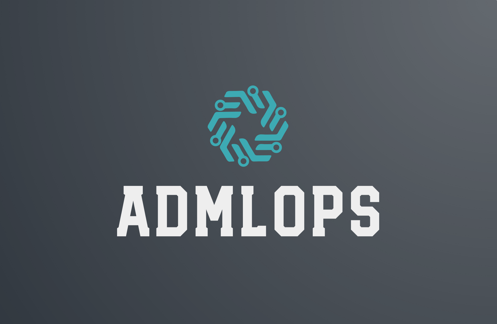

  
  
&nbsp;

[📘使用文档](https://admlops.readthedocs.io/zh_CN/stable/) |
[🛠️安装教程](https://admlops.readthedocs.io/zh_CN/stable/get_started.html) |
[👀模型库](https://admlops.readthedocs.io/zh_CN/stable/model_zoo.html) |
[🆕更新日志](https://admlops.readthedocs.io/en/stable/changelog.html) |
[🚀进行中的项目](https://github.com/windzu/admlops/projects) |
[🤔报告问题](https://github.com/windzu/admlops/issues/new/choose)

[English](README.md) | 简体中文

## 简介

ADMLOps是一个针对自动驾驶感知任务的MLOps开源工具，目标是一站式的解决自动驾驶感知任务中**数据**、**模型**、**部署**这三个问题

主要特性

- **拥抱开源**

  ADMLOps 中很多组成部分是完全依赖开源软件，例如数据部分依赖开源数据集、标注工具、管理工具；模型部分依赖开源算法、开源框架等。很多工作可以通过复用前人的优秀开源软件，没必要将精力用于重复造轮子

- **模块化设计**

  ADMLOps的模型部分主要基于 open-mmlab 的系列工具，借助其优秀的模块化设计，可以轻松的将检测框架解耦成不同的模块组件，通过组合不同的模块组件，用户可以便捷地构建自定义的检测模型

- **紧贴实践**

  ADMLOps 项目的起源是为了提高个人在自动驾驶感知工作中的效率，因此在设计时，ADMLOps 的很多模块都是紧贴实践的，例如传感器的选型、方案的选择、如何标定、数据采集、数据标注、模型的选择、模型的训练、模型的部署等等，都是基于实际工作中的经验总结

- **开箱即用**

  ADMLOps 中将提供大量的 tutorials 和 demo，通过简单的配置即可快速的测试某个数据集在某种模型上的效果，并提供相应的可视化展示

## 最新进展

### 💎 稳定版本

最新的 **1.0.0** 版本

- 基于open-mmlab的一系列框架为基础搭建，具体版本如下
    
    - mmcv：.6.2
    - mmdetection：2.25.1
    - mmsegmentation：0.29.0
    - mmdetection3d：1.0.0rc4
- 

如果想了解更多版本更新细节和历史信息，请阅读[更新日志](docs/en/changelog.md)

### 🌟 2.x 预览版本

该版本基于 mmengine，其目前正在开发中，虽然目前有些框架已经基于此开发，但没有稳定版本，所以本工程的2.x版本暂时不会发布

## 教程

请参考[快速入门文档](docs/zh_cn/get_started.md)学习 ADMLOps 的基本使用。
如果你想使用 ADMLOps 速通一遍自动驾驶感知的整个流程，可以按照以下步骤进行：

- [准备数据集](docs/zh_cn/1_exist_data_model.md)
- [在自定义数据集上进行训练](docs/zh_cn/2_new_data_model.md)
- [在标准数据集上训练自定义模型](docs/zh_cn/3_exist_data_new_model.md)
- [模型部署](docs/zh_cn/tutorials/config.md)

## 常见问题

请参考 [FAQ](docs/zh_cn/faq.md) 了解其他用户的常见问题。

## 贡献指南

我们感谢所有的贡献者为改进和提升 ADMLOps 所作出的努力。我们将正在进行中的项目添加进了[GitHub Projects](https://github.com/windzu/admlops/projects)页面，非常欢迎社区用户能参与进这些项目中来。请参考[贡献指南](.github/CONTRIBUTING.md)来了解参与项目贡献的相关指引

## 开源许可证

该项目采用 [Apache 2.0 开源许可证](LICENSE)

## 欢迎加入 ADMLOps 社区

扫描下方的二维码可加入 ADMLOps 的 QQ 交流频道

我们会在 ADMLOps 社区为大家

- 📢 分享与自动驾驶感知相关的前沿核心技术
- 💻 解读 ADMLOps 常用模块源码
- 📰 发布 ADMLOps 的相关新闻
- 🏃 获取更高效的问题答疑和意见反馈
- 🔥 提供与各行各业开发者充分交流的平台