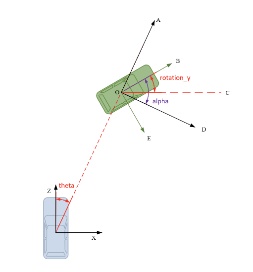
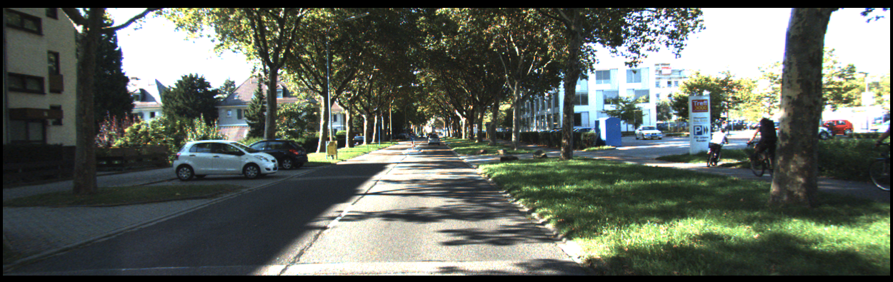

# KITTI

## Introduction

- [官网](https://www.cvlibs.net/datasets/kitti/index.php)

kitti数据集是一个面向自动驾驶任务的数据集，包含了多种任务的数据，包括目标检测，目标跟踪，语义分割，深度估计等

采集数据的传感器包括：

- 1个Velodyne 64线激光雷达
- 1个GPS/IMU 的组合惯导
- 2个140万像素的灰度相机
- 2个140万像素的彩色相机
- 4个变焦镜头

分布位置如下图所示(或参考[官方描述](https://www.cvlibs.net/datasets/kitti/setup.php))：


数据的组织结构如下：

```bash
kitti
├── ImageSets # 包含了训练集和测试集的文件列表
│   ├──test.txt
│   ├──train.txt
│   ├──trainval.txt
│   ├──val.txt
├── testing # 测试集，共7518帧
│   ├── calib
│   ├── image_2
│   ├── velodyne
├── training # 训练集，共7481帧
│   ├── calib
│   ├── image_2
│   ├── label_2
│   ├── velodyne
```

### calib详解

```txt
P0: 7.070493000000e+02 0.000000000000e+00 6.040814000000e+02 0.000000000000e+00 0.000000000000e+00 7.070493000000e+02 1.805066000000e+02 0.000000000000e+00 0.000000000000e+00 0.000000000000e+00 1.000000000000e+00 0.000000000000e+00
P1: 7.070493000000e+02 0.000000000000e+00 6.040814000000e+02 -3.797842000000e+02 0.000000000000e+00 7.070493000000e+02 1.805066000000e+02 0.000000000000e+00 0.000000000000e+00 0.000000000000e+00 1.000000000000e+00 0.000000000000e+00
P2: 7.070493000000e+02 0.000000000000e+00 6.040814000000e+02 4.575831000000e+01 0.000000000000e+00 7.070493000000e+02 1.805066000000e+02 -3.454157000000e-01 0.000000000000e+00 0.000000000000e+00 1.000000000000e+00 4.981016000000e-03
P3: 7.070493000000e+02 0.000000000000e+00 6.040814000000e+02 -3.341081000000e+02 0.000000000000e+00 7.070493000000e+02 1.805066000000e+02 2.330660000000e+00 0.000000000000e+00 0.000000000000e+00 1.000000000000e+00 3.201153000000e-03
R0_rect: 9.999128000000e-01 1.009263000000e-02 -8.511932000000e-03 -1.012729000000e-02 9.999406000000e-01 -4.037671000000e-03 8.470675000000e-03 4.123522000000e-03 9.999556000000e-01
Tr_velo_to_cam: 6.927964000000e-03 -9.999722000000e-01 -2.757829000000e-03 -2.457729000000e-02 -1.162982000000e-03 2.749836000000e-03 -9.999955000000e-01 -6.127237000000e-02 9.999753000000e-01 6.931141000000e-03 -1.143899000000e-03 -3.321029000000e-01
Tr_imu_to_velo: 9.999976000000e-01 7.553071000000e-04 -2.035826000000e-03 -8.086759000000e-01 -7.854027000000e-04 9.998898000000e-01 -1.482298000000e-02 3.195559000000e-01 2.024406000000e-03 1.482454000000e-02 9.998881000000e-01 -7.997231000000e-01
```

calib文件分为7行，是7个矩阵，其中

- P0-P3：3×4的相机的投影矩阵，表示从Cam0到各个相机的内参和外参矩阵之积，0~3所代表的相机与上面的传感器分布图描述一致，分别对应左侧灰度相机、右侧灰度相机、左侧彩色相机、右侧彩色相机
- R0_rect：Cam 0相机的3×3的旋转`修正`矩阵（Tr_velo_to_cam不够准确，所以又附加一个旋转修正）
- Tr_velo_to_cam：3x4的激光坐标系到Cam0坐标系的变换矩阵
- Tr_imu_to_velo：3×4的IMU坐标系到激光坐标系的变换矩阵

### label详解

label信息是以txt文件的形式存储的，在label_2文件夹中，其中每个文件的每一行代表一个目标，每一行的格式如下：

```txt
Pedestrian 0.00 0 -0.20 712.40 143.00 810.73 307.92 1.89 0.48 1.20 1.84 1.47 8.41 0.01
```

标注信息共15列，官方的介绍如下

```txt
#Values    Name      Description
----------------------------------------------------------------------------
   1    type         Describes the type of object: 'Car', 'Van', 'Truck',
                     'Pedestrian', 'Person_sitting', 'Cyclist', 'Tram',
                     'Misc' or 'DontCare'
   1    truncated    Float from 0 (non-truncated) to 1 (truncated), where
                     truncated refers to the object leaving image boundaries
   1    occluded     Integer (0,1,2,3) indicating occlusion state:
                     0 = fully visible, 1 = partly occluded
                     2 = largely occluded, 3 = unknown
   1    alpha        Observation angle of object, ranging [-pi..pi]
   4    bbox         2D bounding box of object in the image (0-based index):
                     contains left, top, right, bottom pixel coordinates
   3    dimensions   3D object dimensions: height, width, length (in meters)
   3    location     3D object location x,y,z in camera coordinates (in meters)
   1    rotation_y   Rotation ry around Y-axis in camera coordinates [-pi..pi]
   1    score        Only for results: Float, indicating confidence in
                     detection, needed for p/r curves, higher is better.
```

对于这些属性需要注意的是：

- type：表示目标类别，kitti默认有9个类别，其中的`DontCare`一般在训练的时候会被选择丢弃不参与训练，`Misc`一般是指那些不在上述9个类别中的目标，比如说一些小的物体，一般也会被丢弃
- truncated：表示目标在边缘被截断程度，范围0-1,0表示未被截断，
- occluded：表示目标是否被遮挡，分四个等级0,1,2,3，0表示为被遮挡
- alpha：描述不清楚，见下图
- bbox：指目标物在2d图像中的标注，左上顶点和右下顶点（x1,y1,x2,y2）
- dimensions:目标的`高、宽、长`。即rotation_y为0时候，`y、z、x`所分别对应的
- location ：目标`底面`在`相机坐标系`中的坐标（x,y,z），注意是`底面`，所以从lidar坐标系转换来得调整y，
- rotation_y：相机坐标系下，以y轴为旋转轴，与x轴的夹角的相反数，单位为弧度（例如与x重合为0，与z重合为`-(-pi/2)`



**实例**


如上图，其中：

- alpha：0.36
- bbox：235.76 183.17 390.22 241.04
- dimensions：1.52 1.64 3.70 ，高宽长
- location ：-8.36 1.84 20.43 （y描述的是3d bbox的底面）
- rotation_y ：-0.03

## Usage

### Format

**to open-mmlab**
在open-mmlab的mmdetection3d中，使用kitti数据集前需要将其转换为pkl格式，官方文档参考[这里](https://mmdetection3d.readthedocs.io/en/latest/data_preparation.html#kitti)
在本工程中转换使用如下命令：

```bash
conda activate ADMLOps && \
cd $ADMLOPS && \
python3 tools/create_data.py kitti --root-path ./data/kitti --out-dir ./data/kitti --extra-tag kitti
```

## Make Dataset
